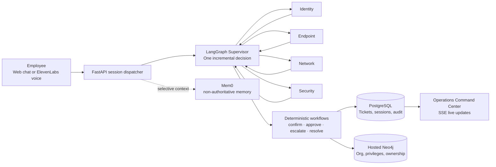

# GA-VoiceAI — Employee IT Support Desk

<p align="center">
  <strong>AI support that investigates safely, acts with consent, and knows when to involve a human.</strong><br />
  A portfolio-grade multi-agent IT support platform for a fictional 60-person organization.
</p>

<p align="center">
  
  
  
  
  
  
</p>


## What it is

GA-VoiceAI gives employees one polished place to get help with access, devices, VPN, software, security concerns, and existing tickets. They can use text chat or an authenticated ElevenLabs voice conversation. Behind the scenes, the system investigates incrementally, performs only eligible self-service actions after explicit confirmation, and hands off safely when a human should decide.

The companion **IT Operations Command Center** makes the work visible: live session timelines, specialist handoffs, typed tool calls, approvals, escalations, persisted audit events, ticket filters, and an interactive organization graph. It deliberately exposes evidence and decisions—not hidden chain-of-thought.

## Architecture at a glance



### The design principle

> **Supervisor orchestrates reasoning. Specialists investigate. Tools interact with systems. Neo4j resolves relationships. PostgreSQL owns operational truth. Humans are the safe final fallback.**

## Technical highlights

| Capability | How it works |
| --- | --- |
| **Bounded multi-agent work** | A Supervisor routes one specialist at a time; specialists return typed results to shared LangGraph state and never call each other directly. |
| **Specialist judgment + evidence** | Identity, Endpoint, Network, and Security agents reason inside a strict domain boundary, use typed tools for verification, and distinguish reported, suspected, and verified facts. |
| **Safe action pipeline** | Privileged actions go through Neo4j entitlement checks, explicit employee confirmation, approval routing when needed, then deterministic execution. |
| **No runaway agents** | Code-enforced limits: 8 supervisor cycles, 5 specialist tool steps, 4 handoffs, 2 structured-output retries, and repeated-transition loop guards. |
| **Auditable by design** | Postgres persists sessions, turns, agent runs, tools, tickets, confirmations, approvals, escalations, failures, and events before SSE broadcast. |
| **Real organizational routing** | Hosted Neo4j provides parameterized traversals for manager, approver, system owner, support team, and escalation target—never generated Cypher. |
| **Context without false authority** | Mem0 records useful recurring support context; privileges, ticket status, ownership, and security state are always re-verified from source systems. |
| **Voice remains one session** | ElevenLabs is a transport layer. Its signed bridge token reaches the same FastAPI dispatcher and LangGraph thread as web chat. |

## Experiences

- **Employee Support:** responsive conversational UI, activity updates, confirmation cards, My Requests, ticket status, dark mode, accessibility support, and optional voice.
- **Operations Command Center:** overview, live sessions, tickets, approvals, escalations, audit trail, and a draggable organization graph with button-based zoom.

## Quick start

### 1. Configure services

Copy `.env.example` to `.env`, then add your OpenAI, hosted Neo4j, and optional Mem0/ElevenLabs keys. Neo4j is intentionally **not** included in Docker; use the connection details from the Neo4j portal.

### 2. Start PostgreSQL and seed data

```powershell
docker compose up -d
cd backend
python -m pip install -e ".[dev]"
python -m alembic upgrade head
python -m app.seeds.seed_org
python -m app.seeds.seed_demo
python run.py
```

### 3. Start the frontend

```powershell
cd frontend
npm install
npm run dev
```

Visit [http://localhost:3000](http://localhost:3000). A sample employee login is `EMP-032` / `gavoiceai-032`; the **Help me** link lists additional roles and privilege levels. Administrator access uses the credentials configured in `.env` (the example values are `admin` / `ga-voiceai-admin`).

## Validate

```powershell
cd backend
python -m pytest -q

cd ..\frontend
npm run lint
npm run build
```

## Learn the codebase

- [System design](docs/DESIGN.md) — contracts, graph topology, data boundaries, execution guards, and acceptance scenarios.
- [Interactive implementation guide](docs/implementation-guide.html) — a visual, product-to-code walkthrough.
- [ElevenLabs voice setup](docs/VOICE_SETUP.md) — signed bridge flow and secure webhook configuration.
- [Contributor guide](AGENTS.md) — project layout, conventions, and commands.

> This is a deliberately realistic demo. The system uses typed mock integrations for safe local exploration; replace those adapters with real enterprise integrations only after applying production identity, authorization, security, and operational controls.
